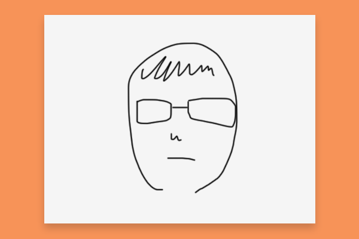

# Animation exercise

## Preparation
- Get a letter-sized paper and fold it twice so that you get four equal-sized sections.
- cut them out cleanly.
- (You will eventually need many pieces of paper to complete this exercise.)

## Drawing frames
- Draw your self-portrait (head only) using black ink on a piece.
- Make an exact copy of your portrait on another piece. It helps to overlay on top to trace the lines.
- Hand the copy over to the person next to you.
- Now, create in-between frames to turn your face into the other person's face.
- Create at least 30 frames.

## Shooting
- Once you're done with drawings, let's take photos so that we can turn your drawings into animation.
- Have your camera (cellphone camera is fine) and drawings ready.
- Choose a flat surface.
- Try to get even lighting throughout the surface. Avoid shadows. You may need to move your lights around or find a different angle.
- Hold your camera down towards your drawing.
- Keep it steady and flat. Avoid shaky or blurry images.
- Make sure the drawing is in focus.
- Try to have your drawing nice and big, but leave a little bit of edge on each side. See image below.
- Bring your original drawings as well as the images you shot.
- Post all the images to Google Drive Week 1 folder **BEFORE** the beginning of next class. **Anything submitted or changed after class started will be marked late.**

