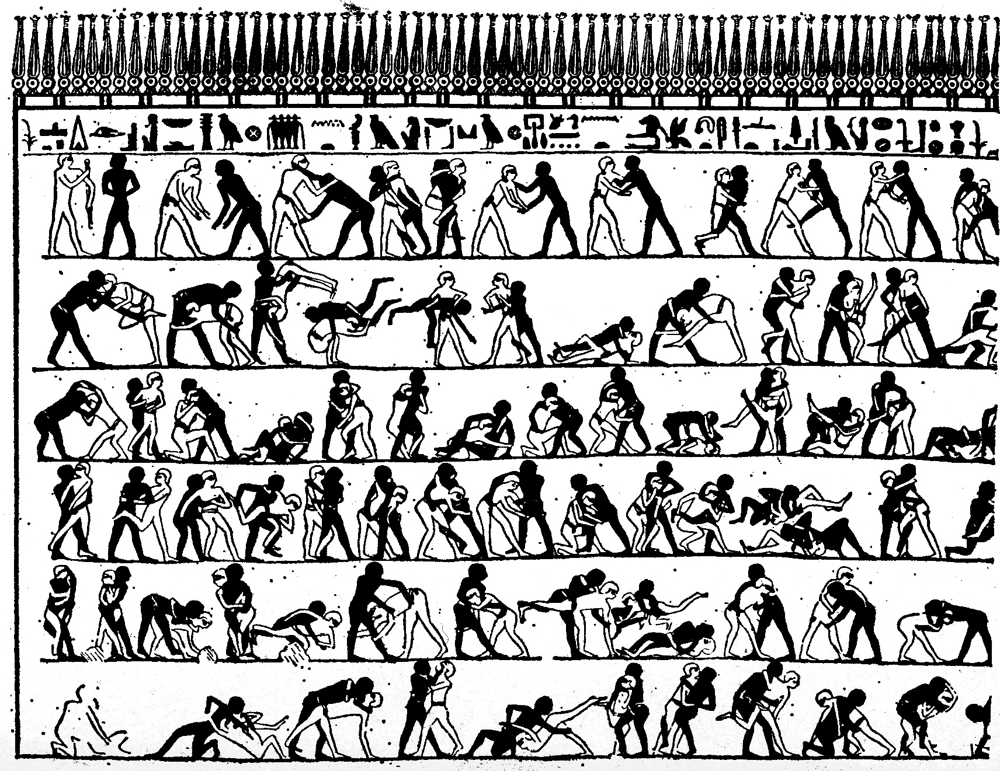
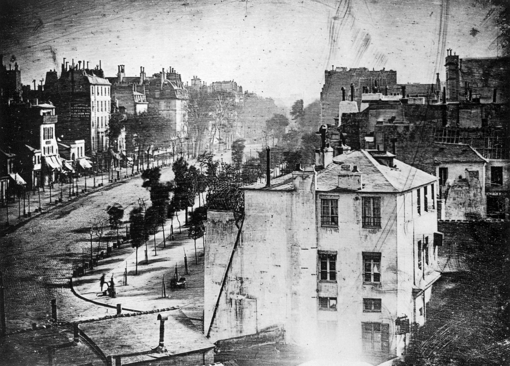

# Optical Devices

One needs not to know how to use a computer, or any kinds of modern technologies, to create animation. You don't need a camera or film, either. People have been creating animation for hundreds of years long before the invention of film[^lumiere]. Optical devices give us an interesting look at the essence of what makes animation possible. We are not merely learning about the history but hoping to find inspirations and directions for our work.

## Ancient Evidences

A vase made from [Iran's Burnt City](https://en.wikipedia.org/wiki/Shahr-e_Sukhteh) about 5200 years ago suggests the oldest effort of recording a movement. Because it is drawn around the vase, which is round, it takes a form of a loop.

An Egyptian mural from about 4000 years ago illustrates detailed movements of wrestlers. 

## Examples of Optical Devices
[Camera obscura](https://en.wikipedia.org/wiki/Camera_obscura) is one of the oldest optical devices and it is still being used. You can [build your own](https://vimeo.com/2859589) if you can completely block the lights. A pinhole camera uses the same principle. The intensity of the light projected is very dim if you compare it to a modern video projector as the light coming in through the tiny hole is not that strong. So, to be able to record an image with the camera, you have to expose the film long enough --- a few minutes to a few hours. 

[Camera lucida](https://en.wikipedia.org/wiki/Camera_lucida) uses a prism glass so that the drawing subject and the drawing can be seen simultaneously. Both camera obscura and camera lucida has [helped many painters to achieve realism](https://en.wikipedia.org/wiki/Hockney–Falco_thesis). The tradition has been almost forgotten until recently when a few scholars [reproduced the device](http://neolucida.com) with the help of 3D printing technology.

There are so many other kinds of optical devices that I cannot introduce them all here. You probably had played with [thaumatrope](https://en.wikipedia.org/wiki/Thaumatrope) when you were young, or made a [flipbook](https://en.wikipedia.org/wiki/Flip_book) by drawing a stick figures on a corner of a textbook. You might have seen a classic [zoetrope](https://en.wikipedia.org/wiki/Zoetrope) or [Pixar's zoetrope](https://www.youtube.com/watch?v=5khDGKGv088). And there are [many](https://en.wikipedia.org/wiki/Phenakistoscope) [other](https://en.wikipedia.org/wiki/Praxinoscope) [optical](http://www.thisiscolossal.com/2016/06/a-fascinating-3d-printed-light-based-zoetrope-by-akinori-goto/) [devices](https://vimeo.com/60582756) out there[^optical-devices].

## Physical Materials
What materials are available to create animation? Often times, it is easier and faster to use traditional materials than try to simulate the same effect inside the computer. Many motion graphics pieces combine multiple materials and techniques to create a unique visual.

### Pen & Pencil
Obviously, the most direct and intuitive way to make visual marks on paper.

### Watercolor painting
We all know how water color paintings look. But how would it look [when it's animated](http://www.willkim.net)?

### Oil painting
An oil painting dries very slowly. So you can paint a single image and keep modifying the same painting while recording the changes frame by frame. That way, you can [keep the rich colors and tones of the oil painting](https://www.youtube.com/watch?v=NGWSYrgB6gM) while saving time by not having to paint every single frame from scratch. But if you make a mistake in the middle of shooting, you will have to start all over again.

### Charcoal
[A charcoal animation](https://www.youtube.com/watch?v=m1oK5LMJ3zY) is similar to oil painting animation in a way that it leaves a trace behind. What does it mean to be able to see the marks from previous drawings?

### Pixilation
Pixilation is an animation technique that uses [real human performers](https://vimeo.com/39056719) and [objects](https://www.youtube.com/watch?v=qBjLW5_dGAM) and record their movements one frame at a time. It is different from live action film because it uses a stop-motion technique rather than continuous recording.

### Rotoscoping
Rotoscoping is a technique of creating animation frames by tracing over an existing footage. The resulting movement is [very realistic](https://vimeo.com/13110245) and the creator can choose what parts to emphasize and what parts to omit. In motion graphics and visual effects, rotoscoping also means creating a matte for compositing purposes. For example, separating a car from its background.

### Unconventional materials
Nearly anything can be animated. Hair, paper, clay, you name it. You can always try something experimental and unconventional. Try animating with materials that you have never tried before. Animate a short sequence. How does it feel to you? How can you use it? 
