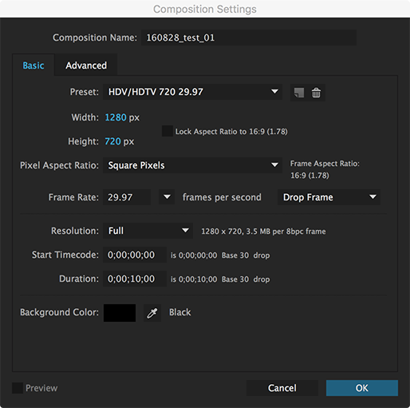

# After Effects Basics

To give you an overview of the basic workflow in After Effects, we will create a very simple slideshow video here.

## Setting up a composition
A composition or a comp is a basic working unit in After Effects. A project file (.aep) will usually have multiple compositions and source files. Create a comp by pressing `Cmd + N` or going to `Composition > New Composition...`.

### Composition Name
Give a descriptive name to your comp. For a complex project, it is a good idea to include today's date. In my case, I named it `170926-test-01`.

### Resolution
There are a few presets you can select from, but you can also type in width and height yourself. We will work with an HD resolution of *1280 x 720 pixels*.

### Pixel Aspect Ratio
Keep it *Square Pixels* unless you will be using video footages from a video camcorder.

### Frame Rate
We will use 24 fps.

### Duration
This is the duration of your comp. There are 4 numbers separated by a semicolon as in `hour;minute;second;frame`. In my case, I typed in `0;00;10;00`, which is 10-second long. Or, you can just type in `1000` and After Effects will convert it properly.

All these settings can be updated later by pressing `Cmd + K` or going to `Composition > Composition Settings...`. It is ok to change the duration any time, but it is not advised to change the screen resolution and the frame rate once you start working on your project. It will affect the visual composition and the timing of your animation.

## Importing assets
You can either create graphic assets directly within After Effects or import as multiple file formats that AE supports. They include image(jpg, png, tiff, etc.), video(quicktime, etc.) and audio(mp3, aiff, etc.). You can also import working file formats such as PSD and AI. AE will preserve all the layer setup.

Here, we will just use simple jpeg images. Find five different landscape images and import into After Effects. To import, the quickiest way is to select the source files and drag them into the project panel.



You will see all the files you imported in the project panel. Please note that these images are *not* part of the AE project file. In other words, the source files you import are not embedded, which means you must keep all your source files with your AE project file. The best way to organize is to create a project folder and keep everything in there. If you move your files around, the link will be broken and you will have to waste your time finding and relinking those files.

## Timeline
Double-click the comp from the project panel if it is not already open in the timeline panel at the bottom half of your screen.

Select all the source files and drag them into the empty timeline of your comp.



You can think of the timeline as the layer panel in Photoshop except for its animation capability. All five images are stacked so all you can see on screen is the top image. You can switch the order, of course.

The blue vertical bar on the timeline is called the *Current Time Indicator or CTI*. If you grab its head and scrub through the timeline, you will quickly scan your animation. Right now, these are just still images, so nothing will change.

## Slideshow
By default, a layer will take up the entire duration of the comp. You can grab either end of the layer and drag to adjust its start and end time. We have a 10 second long composition with 5 photos. Adjust the length of your layers, so each photo takes up 2 seconds.

 

You can press `-` or `=` key on your keyboard to zoom in and out of the timeline to make fine adjustments.

## Animation
We will add simple animation using basic properties such as position, scale and opacity. Follow the instructions.

## Effects
After Effects has a variety of effects that you can use creatively. You can also buy and install third-party effects. Multiple effects can work together.

## Previewing
Grab the CTI and scrub through the timeline to make sure everything looks ok. Every time you make a big change, you would want to play and see how it looks before proceeding to the next step.

If you hit the `Spacebar`, it will play the preview of your animation. It will first *pre-render* the animation into the memory of your computer, so the first time it plays, it may be slow or jittery. But once the pre-render is finished, you will see a bright green bar at the top of your timeline, it will play in real time, which gives you an accurate preview of the final.

## Rendering
This is great, but only you can watch your animation unless you export to a more common video file. 

Select anywhere inside the timeline, so the whole panel is highlighted. Then, go to `Composition > Add to Render Queue`. The render queue panel automatically opens.



Before you hit the blue render button, there are a few settings we need to adjust. First, let's set up the *Output Module*. Click on the blue text 'Lossless.' A dialog pops up. Click the *Format Options* under Video Output section. Change the video codec from *Animation* to *H.264*. Let's leave everything else as it is and hit ok. Hit ok again on the Output Module Settings dialog.

Now, we need to specity where we want to render the file to. Click the blue text next to *Output to*. It should be already set to your comp name. Choose any directory you want to export to.

Now, you are done. All you need to do is to hit the *Render* button and wait until it finishes.

## Testing
Play in a video player you prefer. Make sure everthing looks and plays ok. If not, you can come back to the AE project and make adjustments and repeat the rendering process.

