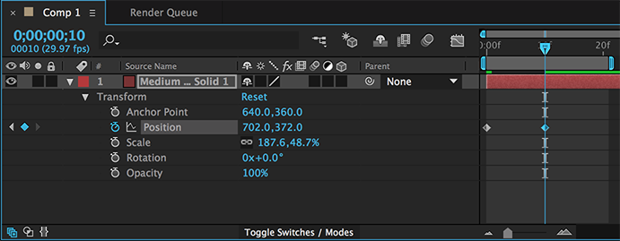

# After Effects Keyframes

In After Effects, you can animate by creating and adjusting keyframes. Any properties with *stop watch button* can be animated. The other way to animate in AE is by writing expressions, which we will discuss later.

1. First of all, you need a composition. You can think of it as a photoshop file. The big difference is that After Effects composition has a timeline.

1. Let’s create a layer so we can practice keyframe animation. 

1. Create the first keyframe by clicking stop watch button. In the picture below, I am animating the position property.  
*Note: Clicking a stop watch icon is to enable the whole keyframe animation. Think of it as a light switch. You turn it on once and keep it that way. If you click the stop watch icon again, your whole animation will be turned off, or removed.*

1. Notice that the stop watch icon is highlighted and a *diamond icon* is also created at the position of the Current Time Indicator. This diamond icon indicates at which frame the keyframe is created.

1. Once you create the first keyframe (it automatically creates one when you click on the stopwatch), anytime you change the value of the property, After Effects automatically creates a new keyframe.

1. Next, let's create the second keyframe. You move the CTI to a frame you want to add a keyframe. 

1. Then, change the value of the property, in this case, Position, by clicking and dragging the blue text box to the left or right. Or, you can move the layer/object directly from the composition preview panel.

1. Notice that the value changes as you drag your mouse. and if you look at the timeline, now you see another diamond icon (keyframe) is created at that frame.

As you work more on your animation, you will be creating tens or hundreds of keyframes, and it can quickly get confusing. Keep this in mind. **Keyframing is always between 2 frames**. Always think of keyframes as a pair of beginning and ending states. Even if you have hundreds of keyframes to edit, you are only editing 2 keyframes at a time.
