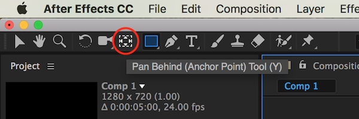
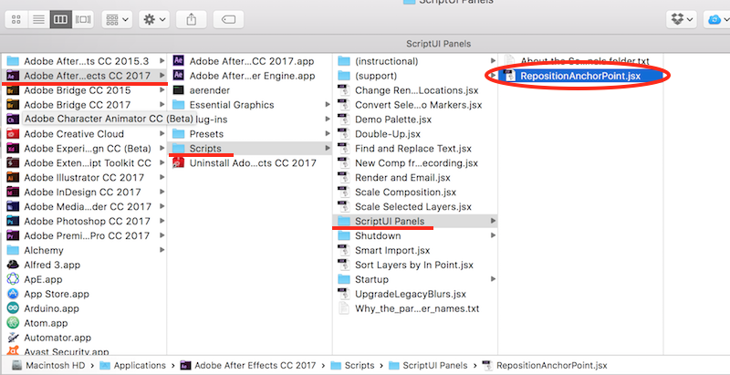

# How to reposition anchor point precisely?
 
A simple way to reposition your anchor point (or, the axis of rotation) is using the Pan Behind (Anchor Point) tool from the top tool bar.
 
 
 
A tip from my experience - set the anchor point *before* you start animating keyframes. Other properties such as position and rotation rely on where the anchor point is to set their own values, so if you edit the anchor point in the middle of keyframing, all the animation will be ruined. There are other workarounds such as using parenting/null objects but we will cover them later. For now, just remember to edit the anchor point *before* animating.
 
This anchor point tool will work in many cases but it won't allow a very precise control as sometimes you need to move the anchor point to the very center of a shape. In that case, use external scripts. I found two promising ones:
 
- http://aescripts.com/repositionanchorpoint/  - you name the price; if you like the product, it's good to support the creator.
- https://www.batchframe.com/tool/Move-Anchor-Point-3/  - 2 dollars
 
 After you download the file, you just need to follow their instructions. In the case of Reposition Anchor Point script, move the script file as below:
 
 
 
 Now, open After Effects and open the panel by going to Window > RepositionAnchorPoint.jsx.
 
 
 
 
