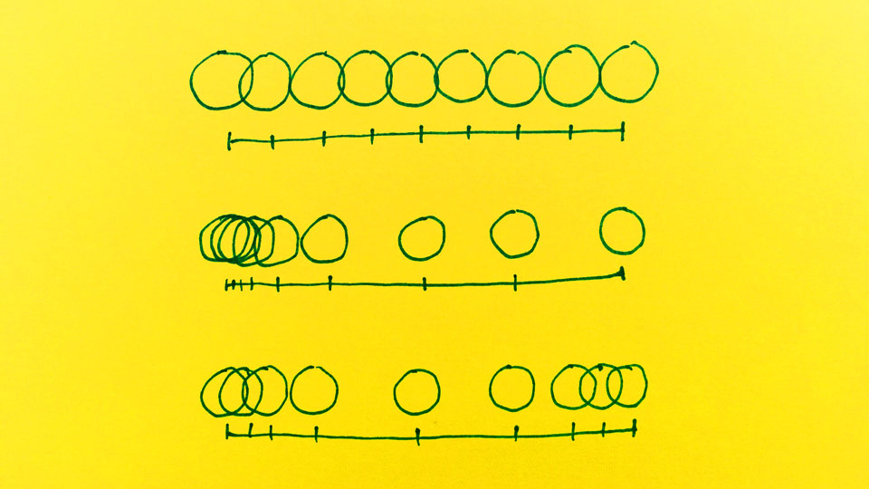
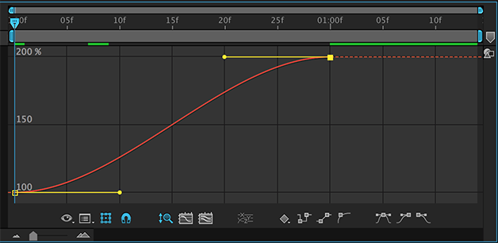
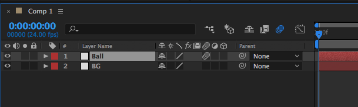

You have a drawing of an object. You make more drawings of the object by applying small changes (ex. position, rotation) every time. Now, the illusion of motion is created but that is not enough to create a *convincing or compelling* animation. Then, how do we create more interesting animation? How can we use the temporal rhythm? The answer is in timing and spacing.

## Timing and Spacing

Let's say we have a set frame rate of 24 fps. How many frames do you need to move an object from point A to B? When should I start moving my object? The *timing* is how long it takes for something to happen. It is not only the duration of an action but also *when* it should take place.

*Spacing* is how much distance there is between each frame or what the characteristic of these spacings is in a motion. We could have two different animation that begin and end at the same time. But what happens with the inbetweens can drastically change the characteristic of the motion.

Above is a technical explanation of timing and spacing, but we also need to think about the context and intention of movements in every situation.  

## Non-moving Objects

It feels very awkward (and annoying) when a movie suddenly stops in the middle. It is very uncomfortable. It is a failure of technology. It is against our expectation. It is unnatural. Our expectation is that nothing in this world is so still. If you look outside when it is quiet, it feels like nothing is moving, but in fact, everything is moving. It's just the relative speed of things moving around us. Cloud moves ever so slightly. Leaves sway gently by the wind. There are dusts floating around.  

### Noise
To avoid that awkward stillness, people use different techniques. Films have a grain of noises which changes every frame. In digital world, you will have to manually add them to your animation.

### Boiling Effect
When your object is not moving, instead of drawing one frame and keep reusing it, you can create 3 frames of the same pose. That way, it will still feel alive.

### Camera movement
A lot of commercials use slight zooming in or out of the camera to add a little bit of dynamics to a scene.

### Secondary animation
Instead of everything start and stop all at the same time, use secondary animation, use follow-through and overlapping actions.

but, wait a second, why do we animate? why do we move things around on screen? just because it is boring or couldn't find any other way to fill the time? I see it all the time --- overly animated pieces. Make sure you understand your own intention, and how you want it to be communicated, and what responses/reactions it will receive. Sometimes, silence is needed.

## Animation Graph

### Easing In & Out
Easing in & out is a very typical way of creating a realistic motion. Everything in this world is governed by different natural forces such as gravity, friction, air resistance, etc. Therefore, it takes time to speed up or down. Everything you do in the computer by default is linear, so it looks very mechanical. You will have to add different types of interpolations to your animation to make it believable.

## Motion Blur
When a fast movement is captured on film, it leaves a motion blur. We are used to seeing motion blurs from tv and movies. Without it, it may create a strobe light effect, which may not be comfortable or convincing to look at.

After Effect has a way to quickly create the motion blur effect. Look at the picture below. Ball layer has motion blur turned on while BG layer doesn't. You can individually turn the motion blur on or off. You will also need to turn on the master switch to preview the effect.

## Further Learning
- [Animation basics: The art of timing and spacing](https://www.youtube.com/watch?v=KRVhtMxQWRs&feature=share) TED video
- Timing and spacing [webinar](http://www.animationmentor.com/resources/webinars/timing-and-spacing/)
- Easing graphs examples at http://easings.net/
