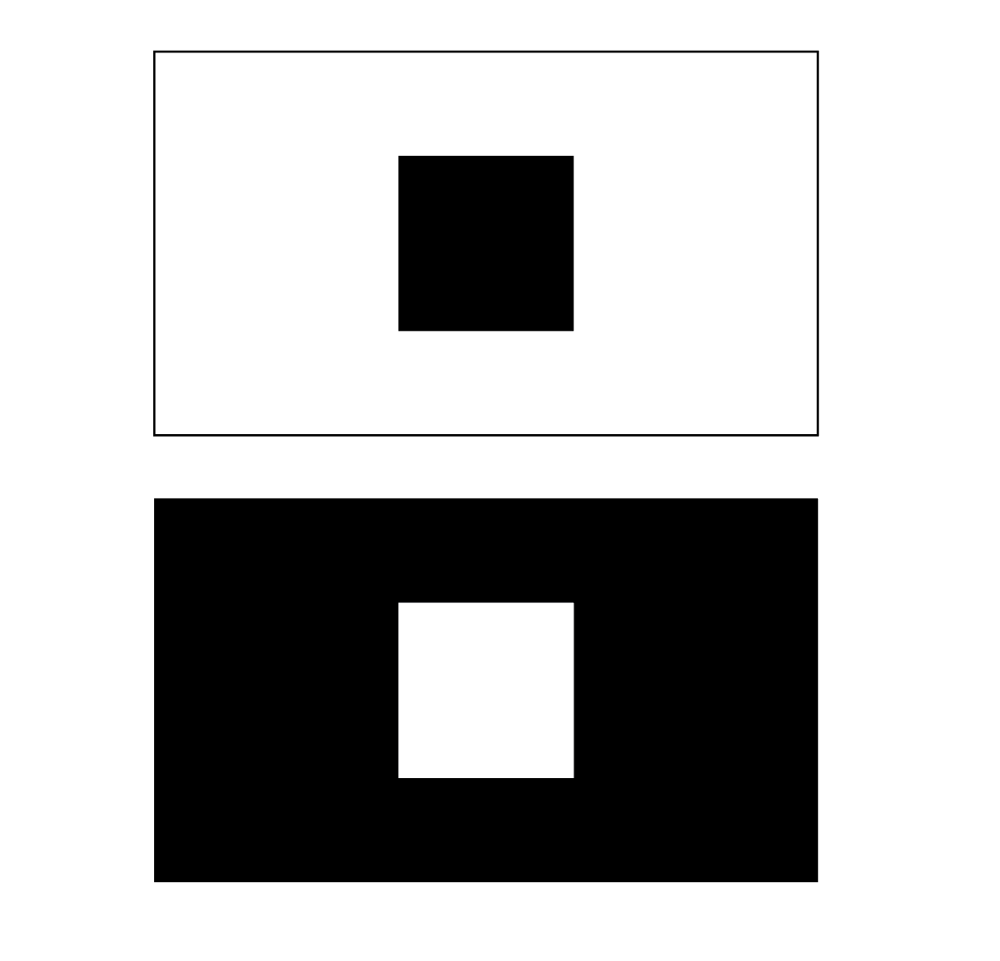

# Black Square White Square

How many ways can you come up with that start with the top composition and end with the bottom one?

- Storyboard as many ideas as you can for 30 minutes.
- Use the rest of the time to animate as many of them as you can in After Effects.
- Explore different forms, rhythms, transitions and effects.
- The only condition: you can only use the greyscale colors (black, grey, white..).
