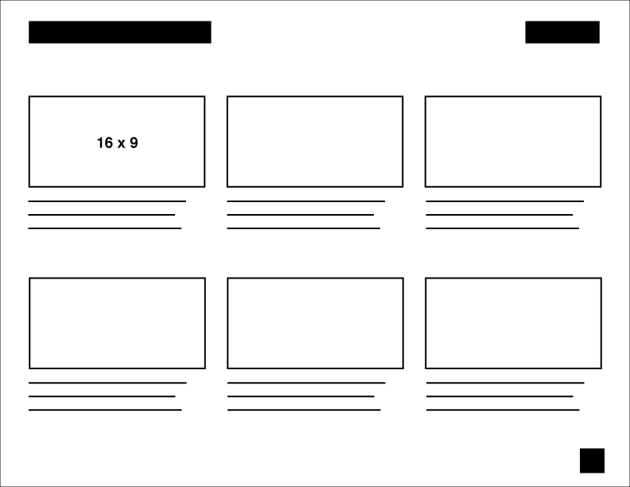

# Week 5 assignments

## Mood exercise
Finish your animation, render out, rename the video file to the name of the word you used, and upload to Google Drive "w5-mood-exercise" folder.

## Project 2: Animate Sound
- Read [the new project brief](proj-sound.md) carefully.
- **Pick two audio clips** that you want to work with. We will eventually choose one next week, but **work with 2 different ideas this week**.
- You may sketch/draw while listening to different music to start thinking about how to translate audito to visual.
- Develop your ideas by making **initial sketches**, exploring different forms and movements.
- Once you have enough ideas to pursue, **create storyboards for each audio clip**. Rough pencil sketches/thumbnails on paper are *not acceptable*. Take time to refine the visual so that we get a pretty clear understanding of your idea. Design the frames in Illustrator.
- Post all the materials - audio clips, sketches, storyboards -- on Google Drive Week 5 folder. **Remember, develop ideas/storyboards for two different audio clips.**

### How to format storyboards
- Set up a letter-sized document **horizontally**.
- On each page, create 6-8 frames. Create more pages as necessary.
- Each frame **must have 16 x 9 aspect ratio.** (same as the actual animation frame)
- Along with the boards include descriptions for each.
- Include the project name, board number, page number and your name on each page.
- There is no number of boards required; make as many as necessary. Any important visuals and changes should be addressed in the boards. You don't need to repeat the boards if they are too similar to each other.
- Submit **a PDF file** on Google Drive.
- Good storyboard examples: [Soomin](../files/storyboard_soomincha.pdf), [Layla](../files/storyboard_laylachoi.pdf)

### Tips for audio editing
If you need to cut or edit an audio file, you may try these softwares.
- Adobe Audition: multi-track editing software, so you can combine different audio clips if you want.
- [Audacity](http://www.audacityteam.org): free software. pretty simple to use.
- AE and Premiere can handle audio, but not recommended.

