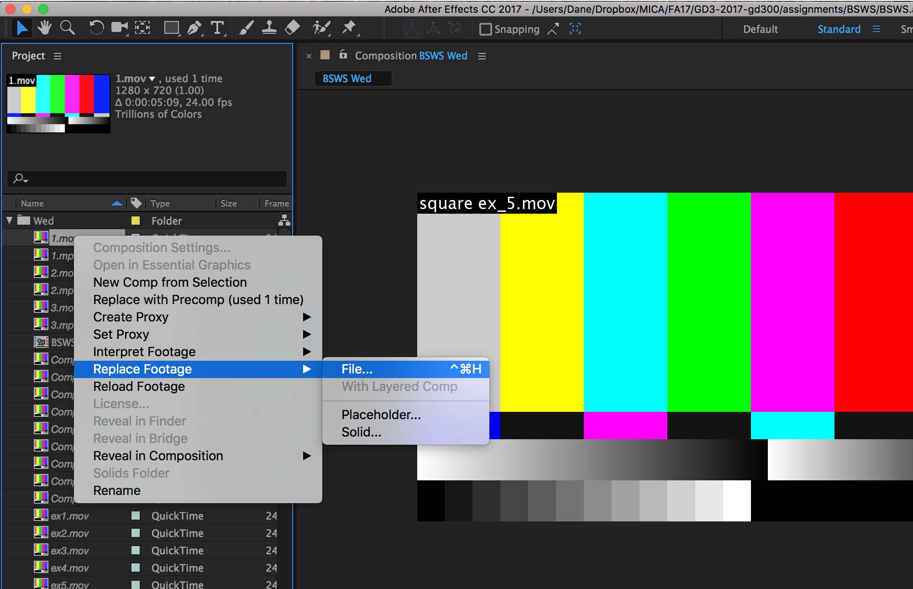

# How to re-link missing videos?

When you move your AE project files or source video files aournd sometime you will accidently break the links between the project and the files. In that case, you don't have to panic. Simply, right-click on the missing video, and choose Replace footage. Then, locate the file and link back again.

