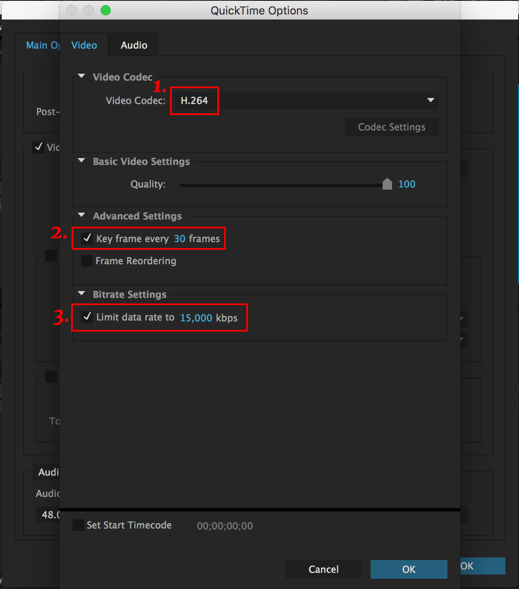

# How to make your video file size smaller?

Even if you use the H.264 video codec, your video file size may seem too big to share online. In that case, change the settings as below.

1. Make sure you are indeed using H.264 codec.

2. Turn on the keyframe setting and set it to 30.

3. Limit data rate to around 15000.

These settings may not work best for every situation. You should render out videos with a few different settings to see which will give you the best quality and file size. Feel free to play with the numbers.

## Helpful links

- Vimeo compression guide:
https://vimeo.com/help/compression

- Youtube compression guide:
https://support.google.com/youtube/answer/1722171?hl=en
