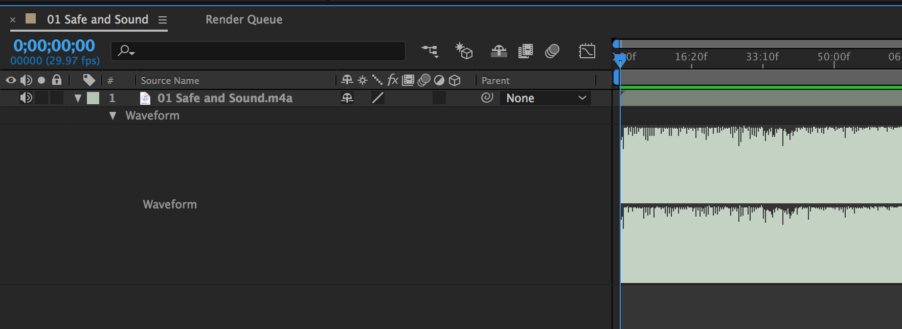

# Working with audio in After Effects

## Preparing the audio file
You can use different audio file formats such as AAC, MP3, WAV, AIFF, etc. If your audio file is not recognized by AE, try importing it into audio editing softwares such as Adobe Audition and re-export. It fixes the problem often times.

## Import audio into AE
You can treat audio files just like any other files. Simply, import into a project and drop onto the timeline.

## Previewing audio
1. Select the audio layer.
1. Hit `L` key twice in a quick succession.
1. It will reveal the waveform, and you can track the beats easier this way.
1. Drag the CTI while holding down the `CMD` key. You can preview audio on a frame level for fine control.

## Adding markers
You can add markers for future references to any frame in the timeline.
1. Select a layer and hit `CTRL` + `8`: add a layer marker.
1. Double-click the marker and add comment. (ex. 1st verse starts)
